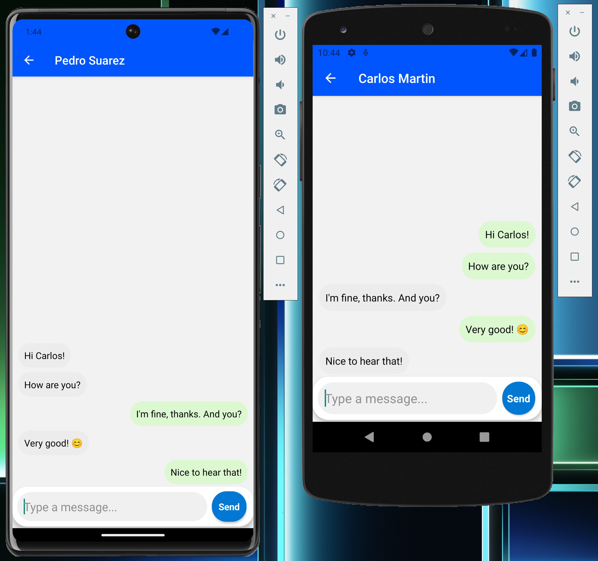

# Beamchat


Beamchat is a cutting-edge chat application built with React Native, designed for secure and efficient communication. It leverages end-to-end encryption using the Elliptic Curve Diffie-Hellman (ECDH) algorithm for generating a shared secret, ensuring that your messages remain private and secure.

## Features

- **Real-time messaging**: Instantly send and receive messages with Socket.IO.
- **End-to-end encryption**: Utilize ECDH for generating a shared secret for encrypting chats, ensuring complete privacy.
- **Cross-platform**: Built with React Native for seamless operation on both iOS and Android.
- **User-friendly interface**: An intuitive and sleek design for an optimal user experience.
- **Secure Authentication**: Protect user accounts and data with robust authentication mechanisms.

## Example

Chat secure with your friends!



## Backend

In order to run the project, it's necessary to run the backend side.

Clone the following repos and follow the instructions detailed in each one. It's important to run the backend first with Docker, and then this application.

Main backend, needed for business logic: [beamchat-backend](https://github.com/Beamersoft/beamchat-backend)

Socket.io backend, needed for the chat logic: [beamchat-socket](https://github.com/Beamersoft/beamchat-socket)

## Getting Started

### Prerequisites

- Node.js (LTS version recommended)
- npm or yarn
- React Native CLI
- Android Studio or Xcode (for iOS development)

### Installation

1. Clone the repository:

```bash
git clone https://github.com/Beamersoft/beamchat-frontend.git
cd beamchat-frontend
```

2. Install dependencies:

```bash
npm install
# or
yarn install

## Make sure the patch for brorand inside ./patches is applied when installing modules.
```

3. Run the app:

```bash
npx expo run:android
# or
npx expo run:ios
```